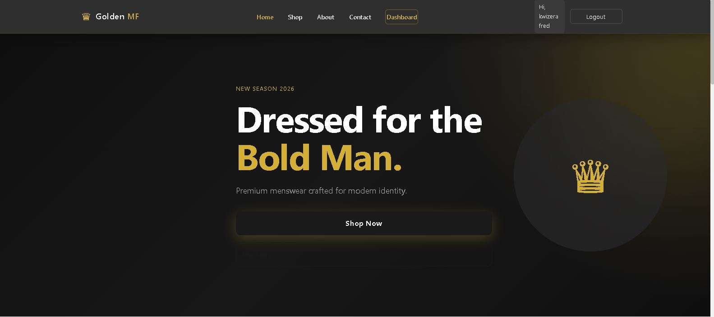
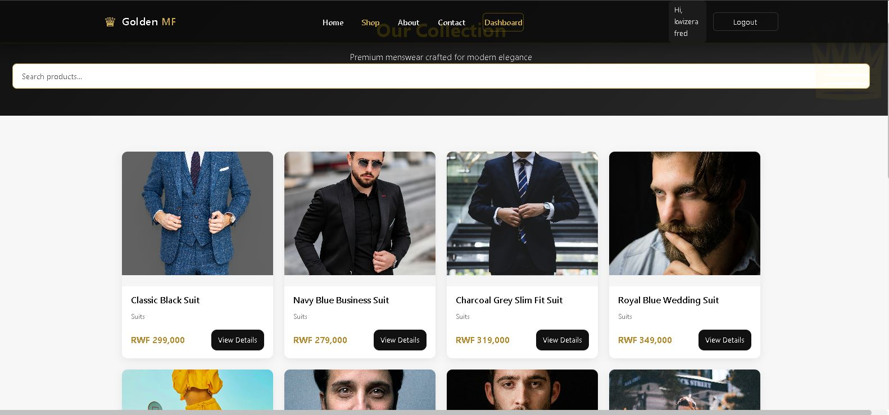
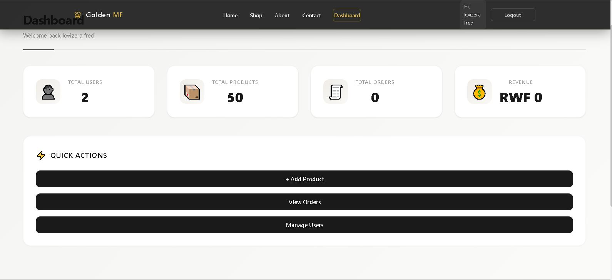
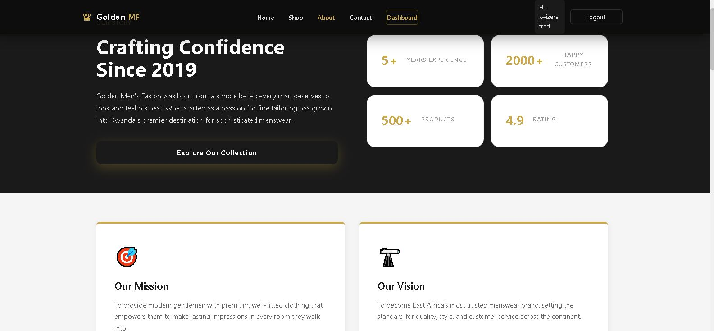
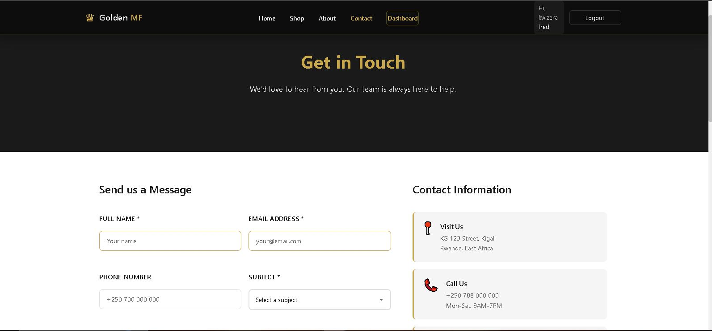

# Golden MF - Premium E-Commerce Platform

## 📌 Student Information
* **Student Name:** Kwizera Fred
* **Registration number:** 23718/2024
* **Course:** E-Commerce and Web Application (EWA408510)
* **Institution:** University of Lay Adventists of Kigali (UNILAK)
* **Academic Year:** 2025-2026 | Semester: II
* **Lecturer:** Eric Maniraguha

---

## 🏬 Project Overview
**Golden MF (Golden Men's Fashion)** is a premium e-commerce platform designed for modern gentlemen, specialized in offering high-end, sophisticated menswear and tailor-fitted suits in Rwanda and across East Africa. Born from a simple belief that every man deserves to look and feel his best, the store blends artisan excellence with streamlined digital shopping experiences.

* **Live Website Link:** [Click Here to View Live Website](https://goldenmensfashion.netlify.app/) *(Replace with your actual hosted link)*
* **GitHub Repository:** [Click Here to View Repository](https://github.com/) *(Replace with your actual repository link)*

---

## 🎨 Platform & Design Choice
* **Platform/Stack:** Low-Code Custom Framework / Tailored Template Engine with a responsive front-end dashboard, styled with dark themes, gold highlights, and modern glassmorphism panels to match luxury branding standards.
* **Design Philosophy:** Premium luxury minimalist UI featuring a dark ambient color scheme (`#121212`), high-contrast typography, crisp visual cards, interactive quick actions, and clean statistics visualizations.

---

## ✨ Features Implemented

### 1. User & Identity Management
* Logged-in session detection displaying greetings (e.g., `"Hi, kwizera fred"`).
* Interactive navigation bar with unified state control for authenticated status and quick profile logouts.

### 2. Comprehensive Storefront System
* **Dynamic Homepage:** Welcoming high-impact banner emphasizing the **"New Season 2026"** and **"Dressed for the Bold Man"** campaign concept.
* **Product Catalog ("Our Collection"):** Clean multi-column grid containing curated high-resolution imagery, pricing details in **Rwandan Francs (RWF)**, categories, and deep-link product action components (`View Details`).
* **Interactive Search Bar:** Universal full-width filter container allowing prospective buyers to search item terms in real-time.

### 3. Business Dashboard Analytics & Quick Actions
* Real-time metrics breakdown tracking four essential key performance indicators (KPIs):
  * **Total Users** registered.
  * **Total Products** actively cataloged.
  * **Total Orders** pending fulfillment.
  * **Gross Revenue** statements calculated inside local currencies (RWF).
* Unified administration control buttons for continuous system operations: `+ Add Product`, `View Orders`, and `Manage Users`.

### 4. About & Brand Authority Section
* Embedded corporate profile showcasing the business narrative timeline ("Crafting Confidence Since 2019").
* Credibility assurance milestones (5+ Years Experience, 2000+ Customers, 500+ Active Stock Items, and a 4.9 Star Rating).
* Core pillars visualization defining clear **Mission** and **Vision** cards focused on local empowerment and Pan-African expansion.

### 5. Multi-Channel Support & Interactive Forms
* Functional messaging interface validating Full Name, Email, Phone Numbers, and cascading Subject lines.
* Precise geolocation details anchoring physical brand presence within Kigali, Rwanda (**KG 123 Street**).

---

## 📸 Interface Screenshots

Here are the visual layouts captured from the active application ecosystem, loaded directly from the repository's `images/` directory:

### 🏠 Homepage Layout
*Featuring hero branding accents and deep navigation hooks.*

### 👔 Product Collection Catalog
*Displaying dynamic product grid components with pricing structures.*

### 📈 Administrative Management Dashboard
*Providing high-level business analytics overview and operational controls.*

### 📜 Brand Identity & Profile ("About Us")
*Detailing core values, market metrics, and strategic long-term vision statements.*

### 📞 Contact & Engagement Portal
*Presenting interactive customer inquiry forms and localization checkpoints.*

---

## 🚀 Challenges & Technical Overcomes

1. **Visual Consistency across Component Frameworks:**
   * *Challenge:* Managing premium visual appeal across several different core views (Shop vs. Admin Dashboard) risked breaking uniformity.
   * *Solution:* Built a robust base layout system sharing a universal dark-mode color scheme, custom glass-container elevations (`box-shadow`), and unified typographic scale standards.

2. **Localization and Numeric Precision:**
   * *Challenge:* Adapting default placeholder currencies to correctly handle Rwandan Francs (`RWF`) values while formatting custom layouts neatly inside product layout cards without text wrapping glitches.
   * *Solution:* Formatted explicit layout containers using structured blocks (`box-sizing: border-box`) ensuring adaptive dimensions for dynamic text lengths.

---

## 💡 Lessons Learned

* **UI/UX Strategy Matters for E-Commerce:** High-end boutique items sell through layout confidence. Implementing minimalist black and gold color palettes dramatically improves user retention and simulated purchase intent.
* **Data-Driven Administration:** Integrating clear analytics summary blocks directly alongside administrative quick action links increases operational speed and reduces cognitive load during site management.
* **Portfolio Organization:** Documenting layout components using Markdown structures enforces clean development workflows, serving as a ready-to-deploy professional project representation.
